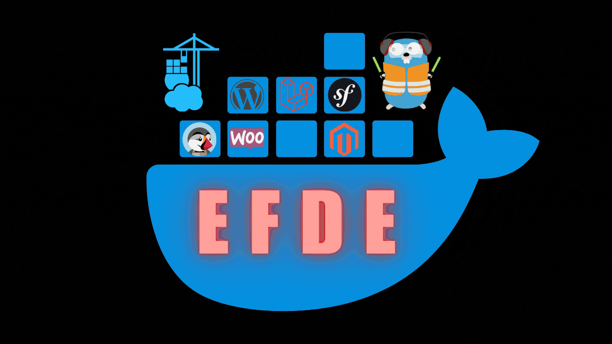
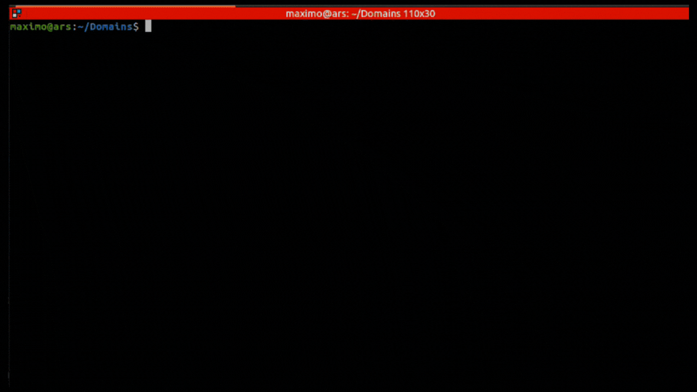

# EFDE | Easy and Fast Development Environment [](https://www.youtube.com/@Efde.official)

 


   

## Index

- [Intro](#intro)
- [Installing or Updating or Uninstall](#install--update)
- [Usage](#usage)
- [Mission](#mission)
- [Documentation](#documentation)
  - [Doc for Developer (Collaborators)](docs/developer.md) 🔥
  - [Code of conduct](#code-of-conduct) | [Maintainers](#maintainers) | [Contributing](#contributing) | [License](#license)

## Intro

EFDE is a project designed to facilitate the management of local development environments, mainly for teams that constantly have new members or beginners who are starting out in this beautiful world of programming.

The objective of the project is to be able to manage implementations with docker such as

### Released

[](#)

[](https://www.php.net/)
[](console/implemention/laravel/docs/README.md)
[](console/implemention/symfony/docs/README.md)
[](console/implemention/wordpress/docs/README.md)

### Coming soon

[](docs/developer.md)

[](https://www.php.net/)
[](docs/developer.md)
[](docs/developer.md)

[](docs/developer.md)
[](docs/developer.md)
[](docs/developer.md)
[](docs/developer.md)

[](docs/developer.md)
[](docs/developer.md)

## Install & Update

### Requirements

The **EFDE** installation script. It will check and recommend the installation of the necessary packages for its proper functioning.
Anyway, if you want to know more, you can see the following list with the official documentation

#### Compatibility


#### For download

[](https://curl.se/docs/install.html)
[](https://www.gnu.org/software/wget/)

#### Implement (If you do not have it installed, EFDE manages the installation on Linux)

[](https://git-scm.com/book/en/Getting-Started-Installing-Git)
[](https://docs.docker.com/engine/install/ubuntu/)
[](https://docs.docker.com/compose/install/other/)

### Install
#### Manual 
For manual installation you must
<details>
<summary>Distro debian/ubuntu</summary>

```sh
mkdir -p ~/.efde
cd $_
git clone https://github.com/mmaximo33/EFDE.git .

ln -sfT $PWD/bin/efde.sh ~/bin/efde

# In case you want to test a branch
# git switch <branch>
```
</details>

<details>
<summary>In Windows</summary>

```sh
Coming soon
```
</details>

<details>
<summary>In MacOS</summary>

```sh
Coming soon
```
</details>

#### For script 

Run the following command (**CURL** or **WGET**) to install **EFDE** on your computer

```sh
curl -o- https://raw.githubusercontent.com/mmaximo33/efde/main/bin/install.sh | bash
```

```sh
wget -qO- https://raw.githubusercontent.com/mmaximo33/efde/main/bin/install.sh | bash
```



### Update & Uninstall


## Usage

### New project

- Once **EFDE** is installed
- Go to the directory where you create your projects (example: `~/Domains`)
- Run `efde`  in your command console

### Created with EFDE

- In case you are in a project created with **EFDE**. Example: `~/Domains/newproject`
- The menu for that implementation will be displayed (Symfony, Laravel, Magento, Wordpress, WooComerce, Prestashop, React, Angular, Vue, Others)


### Shortcuts

Since version 2.1.0, shortcuts are available. You can see the list by running `efde efde:shortcuts`


## Mission

EFDE arises motivated by giving something back to this beautiful community of programmers, computer scientists or curious about technology.

After having gone through some companies, participated in several teams, been a mentor to team members with beginner profiles and even taught this world to family and friends.
I realized that today there are several elements (services, tools, systems, others) that orbit around trying to learn a language, framework or technology.

EFDE aims to standardize, automate and simplify the deployment or preparation of local development environments for different projects. Without losing the flexibility that they can be customized or adjusted according to the need or complexity of the project.

EFDE is not the definitive solution to your problems, sooner or later you will have to understand exactly what is happening behind the things, but you will acquire the answers of what, when, where, for what and why, as you use it.

Who is it for?
It originally arises to help understand and expedite the induction process for those new members of a project or those people who are starting out in the world of programming and are not entirely clear about some knowledge, concepts or bases of services, applications or implementations. .

But it's also thinking of those developers who have a bit more experience and really want to have a little tool to help them do the usual tasks.

Whatever your level, EFDE will be interesting for you!
You are invited to join, use or even contribute to the growth of EFDE to give back to the developer community and open the doors to the new generations.

It is NOT something super innovative, but surely more than one will find it interesting.

## Documentation

### Code of conduct

The collaborators of this project strongly believe in a respectful community.
For this reason we operate under the following [CODE OF CONDUCT](./CODE_OF_CONDUCT.md)

### Maintainers

Currently, the sole maintainer is [@mmaximo33](https://github.com/mmaximo33) - more maintainers are quite welcome, and we hope to add folks to the team over time.
[GOVERNANCE](./GOVERNANCE.md) will be re-evaluated as the project evolves.

### Contributing

There is still a lot to do with this small project if you are invited to join.
Please see [CONTRIBUTING](./CONTRIBUTING.md) for details.

### License

The MIT License (MIT). Please see [LICENSE](./LICENSE.md).

## Collaborate with us

<a href="https://jb.gg/OpenSourceSupport" target="_blank">
  
</a>
