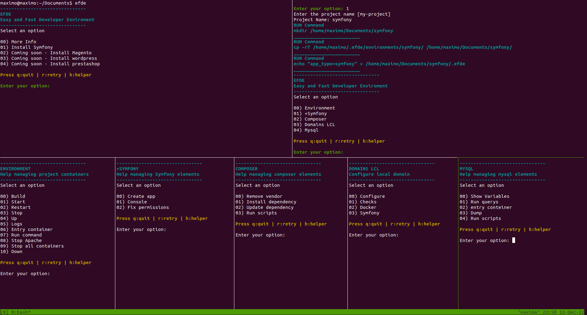

# EFDE
# Easy and fast development environment [][4]

## Table of Contents

- [Intro](#intro)
- [About](#about)
- [Installing and Updating](#installing-and-updating)
  - [Install](#install)
  - [Update](#update)
  - [Verify Installation](#verify-installation)
- [Usage](#usage)
- [Maintainers](#maintainers)
- [Contributing](#contributing)
- [License](#license)

## Intro

EFDE arises motivated by giving something back to this beautiful community of programmers, computer scientists or curious about technology.

After having gone through some companies, participated in several teams, been a mentor to team members with beginner profiles and even taught this world to family and friends.
I realized that today there are several elements (services, tools, systems, others) that orbit around trying to learn a language, framework or technology.

EFDE aims to standardize, automate and simplify the deployment or preparation of local development environments for different projects. Without losing the flexibility that they can be customized or adjusted according to the need or complexity of the project.

EFDE is not the definitive solution to your problems, sooner or later you will have to understand exactly what is happening behind the things, but you will acquire the answers of what, when, where, for what and why, as you use it. .

Who is it for?
It originally arises to help understand and expedite the induction process for those new members of a project or those people who are starting out in the world of programming and are not entirely clear about some knowledge, concepts or bases of services, applications or implementations. .

But it's also thinking of those developers who have a bit more experience and really want to have a little tool to help them do the usual tasks.

Whatever your level, EFDE will be interesting for you!
You are invited to join, use or even contribute to the growth of EFDE to give back to the developer community and open the doors to the new generations.

It is NOT something super innovative, but surely more than one will find it interesting.

## About

EFDE is a project designed to facilitate the management of local development environments, mainly for teams that constantly have new members or beginners who are starting out in this beautiful world of programming.

The objective of the project is to be able to manage implementations with docker such as

- Symfony
- Magento
- Wordpress
- WooCommerce
- Prestashop
- Django
- Others

## Install & Update

### Install

To **install** or **update** EFDE, you should run the install script. To do that, you may either download and run the script manually, or use the following cURL or Wget command:

```sh
curl -o- https://raw.githubusercontent.com/mmaximo33/efde/main/setup/install.sh | bash

wget -qO- https://raw.githubusercontent.com/mmaximo33/efde/main/setup/install.sh| bash
```

### Update 

EFDE checks if there is an update each time it is called, it will ask if you want to update it or postpone it to the future

## Usage

Once installed, you can run EFDE from any directory

```sh
$ efde --help
```

## Captures



## Maintainers

Currently, the sole maintainer is [@mmaximo33](https://github.com/mmaximo33) - more maintainers are quite welcome, and we hope to add folks to the team over time. [Governance](./documentation/GOVERNANCE.md) will be re-evaluated as the project evolves.

## Contributing

Please see [CONTRIBUTING](./documentation/CONTRIBUTING.md) for details.

## License

The MIT License (MIT). Please see [License File](./LICENSE).
