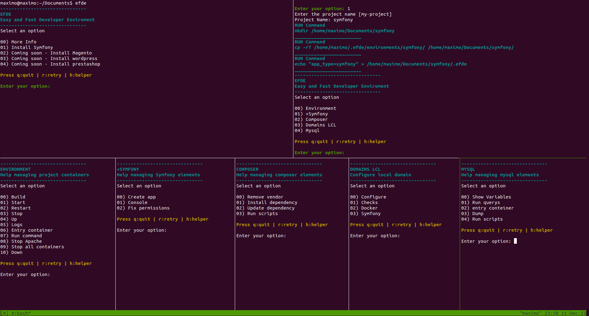

# Easy and fast development environment (EFDE) [](https://www.youtube.com/@Efde.official)

    

## Table of Contents

- [Intro](#intro)
- [Installing and Updating](#install--update)
  - [Install](#install)
  - [Update](#update)
- [Usage](#usage)
- [About](#about)
- [Documentation](#documentation)
  - [Code of conduct](#code-of-conduct)
  - [Maintainers](#maintainers)
  - [Contributing](#contributing)
  - [License](#license)

## Intro

EFDE is a project designed to facilitate the management of local development environments, mainly for teams that constantly have new members or beginners who are starting out in this beautiful world of programming.

The objective of the project is to be able to manage implementations with docker such as

### Released

:heavy_check_mark: [Symfony](docs/symfony.md)

### Coming soon

- Portainer.io
- Wordpress
  - WooCommerce
- Magento
- Prestashop
- Django
- Others

## Install & Update

### Requirements

The EFDE installation script. It will check and recommend the installation of the necessary packages for its proper functioning.
Anyway, if you want to know more, you can see the following list with the official documentation

- For download
  - [CURL](https://curl.se/docs/install.html) or [WGET](https://www.gnu.org/software/wget/)
- Implement (If you do not have it installed, EFDE manages the installation on Linux)
  - [GIT](https://git-scm.com/book/en/Getting-Started-Installing-Git) 
  - [docker](https://docs.docker.com/engine/install/ubuntu/)
  - [docker compose](https://docs.docker.com/compose/install/other/)

### Install

To **install** EFDE, you should run the install script. To do that, you may either download and run the script manually, or use the following cURL or Wget command:

[See Youtube - Short](https://www.youtube.com/shorts/gE3qYC1AUOk)

```sh
curl -o- https://raw.githubusercontent.com/mmaximo33/efde/15-migrate-to-full-bash/bin/install.sh | bash
```
```sh
wget -qO- https://raw.githubusercontent.com/mmaximo33/efde/15-migrate-to-full-bash/bin/install.sh | bash
```
#### What will happen in the installation process?

```sh

#######################################################################
# Verifying requirements for EFDE
-----------------------------------------------------------------------
── [OK] Check install GIT
── [OK] Check install DOCKER
── [OK] Check install DOCKER-COMPOSE
── [SUCCESS] Requirements verified

#######################################################################
# Installing EFDE
-----------------------------------------------------------------------
── The /home/maximo/.efde directory exists without version control (.git)
─── Do you want to create a backup? [y/N]? y
──── Creating a backup
────── [SUCCESS] Backup created in /home/$USER/.efde_bkp_install_20231231123418
── Downloading EFDE from git to /home/$USER/.efde
──── Cloning repository
──── Repository optimization
────── [SUCCESS] Compression
────── [SUCCESS] Cleaning
── Creating symbolic link
──── Removing symbolic link previous versions (v1.*.*)
──── In /home/$USER/bin/efde FROM /home/$USER/.efde/bin/efde.sh

#######################################################################
# EFDE is successfully installed and configured.
# Select the directory and create your new project
# By running '$ efde --help'
-----------------------------------------------------------------------
You want to run efde --help now? [Y/n]? 
```

### Usage

- Once installed, you can run EFDE from any directory
- If you are in a project created with EFDE, it will give you the options available for that environment

```sh
# Run command in console
efde
```

## Captures



## About
EFDE arises motivated by giving something back to this beautiful community of programmers, computer scientists or curious about technology.

After having gone through some companies, participated in several teams, been a mentor to team members with beginner profiles and even taught this world to family and friends.
I realized that today there are several elements (services, tools, systems, others) that orbit around trying to learn a language, framework or technology.

EFDE aims to standardize, automate and simplify the deployment or preparation of local development environments for different projects. Without losing the flexibility that they can be customized or adjusted according to the need or complexity of the project.

EFDE is not the definitive solution to your problems, sooner or later you will have to understand exactly what is happening behind the things, but you will acquire the answers of what, when, where, for what and why, as you use it.

Who is it for?
It originally arises to help understand and expedite the induction process for those new members of a project or those people who are starting out in the world of programming and are not entirely clear about some knowledge, concepts or bases of services, applications or implementations. .

But it's also thinking of those developers who have a bit more experience and really want to have a little tool to help them do the usual tasks.

Whatever your level, EFDE will be interesting for you!
You are invited to join, use or even contribute to the growth of EFDE to give back to the developer community and open the doors to the new generations.

It is NOT something super innovative, but surely more than one will find it interesting.

## Documentation

### Code of conduct

The collaborators of this project strongly believe in a respectful community.
For this reason we operate under the following [CODE OF CONDUCT](./CODE_OF_CONDUCT.md)

### Maintainers

Currently, the sole maintainer is [@mmaximo33](https://github.com/mmaximo33) - more maintainers are quite welcome, and we hope to add folks to the team over time.
[GOVERNANCE](./GOVERNANCE.md) will be re-evaluated as the project evolves.

### Contributing

There is still a lot to do with this small project if you are invited to join.
Please see [CONTRIBUTING](./CONTRIBUTING.md) for details.

### License

The MIT License (MIT). Please see [LICENSE](./LICENSE.md).

## Collaborate with us

<a href="https://jb.gg/OpenSourceSupport" target="_blank">
  
</a>
