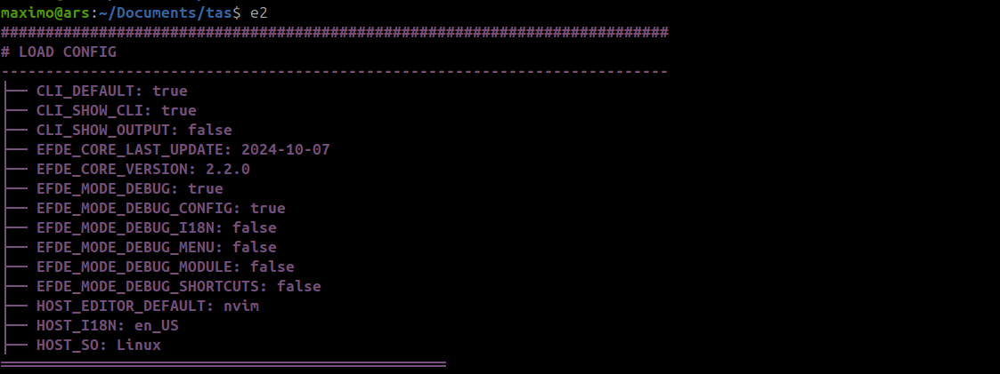

# EFDE | Easy and fast development environment
In this small guide you will find all the necessary elements if you want to start collaborating on the project.

Here are mentioned the variables and workflow that must be considered when
- Fix a bug
- Improve an existing feature
- Add a new feature

# Report issue 
In case you want to contribute, you can do so by reporting a new issue from [here](https://github.com/mmaximo33/EFDE/issues/new/choose)

to begin following up on the request.

# Prepare development environment
To prepare the EFDE development environment, see the following steps according to the corresponding role.

## Collaborators

```sh
# Prepare environment
mkdir -p ~/Domains
cd $_
git clone https://github.com/mmaximo33/EFDE.git efdev
cd $_
ln -sfT $PWD/bin/efde.sh ~/bin/efdev 
# Check the installation by running 'efdev' in your console

# Begin to work
git switch develop
git pull origin master
git checkout -b <issue-new-feature> # example 31-description-of-new-feature
git add <files>
git commit "feat/fix (environment): feature description" # See https://www.conventionalcommits.org/en/v1.0.0/

# Confirm that it is up to date with other updates
git rebase origin/develop
# Verify that there are no conflicts
git status
# If there are, resolve them, add the changes and commit.
# git add <files>
# git commit "fix (environment):  resolved conflicts"
# git rebase --continue

# Upload your changes
git push origin <issue-new-feature> --force-with-lease
```

### Settings

#### For full developer

To have all developer features enabled, modify the `bin/config.env` file generated after the first run 

```sh

EFDE_MODE_DEBUG="false"             # Debug general (It is required for the rest of MODE)
EFDE_MODE_DEBUG_CONFIG="false"      # Debug load config
EFDE_MODE_DEBUG_MODULE="false"      # Debug load modules
EFDE_MODE_DEBUG_SHORTCUTS="false"   # Debug load shortcuts
EFDE_MODE_DEBUG_I18N="false"        # Debug load translations
EFDE_MODE_DEBUG_MENU="false"        # Debug load menu

```
<details>
<summary>Debug Essential</summary>


</details>

<details>

<summary>Debug CONFIG</summary>


</details>

<details>

<summary>Debug MODULES</summary>


</details>
<details>

<summary>Debug SHORTCUTS</summary>


</details>
<details>

<summary>Debug I18N</summary>


</details>
<details>

<summary>Debug MENU</summary>


</details>

### EFDE_MODE_DEBUG

|                                                    |                                                                                  | 
|----------------------------------------------------|----------------------------------------------------------------------------------|
| Shows additional information for debugging actions | On each run, clean the `bin/.tmp` directory and transform the files individually | 
|     |                             |       


### Rules for developer
If you want to add a new feature you must keep the following rules in mind
- Define type
  - **Service**: (docker, mysql, phpmyadmin, mailhog, others)
  - **Implementation**: frameworks, cms, others (symfony, laravel, magento, woordpress, prestashop, others)
- Inside `console/{Implementation | Service}`, create a directory named after your new implementation or service (example: `myserv`)
  - In `console/service/myserv`
  - Create the directories
    - `./tasks`
      - Create your files, the methods here must start with `_mod_.FUNCTION_NAME`
      - You can call other methods as appropriate to your location `common.tasks.menu.FUNCTION_NAME`
    - `./props`
      - Create your files, the properties here must start with `_mod_PROPERTY_NAME`
        - **Important**: It does not have the point in the middle like the methods `_mod_.` vs `_mod_` 

### Shortcuts
If you want to add shortcuts to your new deployment, just add the file in `console/service/myserv/props/shortcuts`
The file must contain the following format, where each column represents a piece of data.

**Important**: DO NOT CHANGE VARIABLE NAME `_mod_ITEMS`
```bash
#!/usr/bin/env bash
{
  _mod_ITEMS=(
    "shortcut,                  path.of.a.function,                   Description"          
    "myserv:test,               myserv.tasks.file.function,           This is a shortcut test"
  )
}
```

### Translations
- Translations must be incorporated into each implementation with the **i18n** directory
- The languages available so far are
    - en_US (Default)
    - es_ES
    - pt_PT
- They must follow the following pattern `
"text_en_us","text_translations"`
- **Important**: You cannot use characters like `\ \"`


### Boot sequence | Workflow

#### Basic 
- Load essential elements
- Load `bin/config.env` configuration
- Load modules
- Build shortcuts
- Apply translations
- Load menu

#### Details
Taking into account the installation carried out previously.

- When executing in glogal symbolic link `~/bin/efdev -> ~/Domains/bin/efde.sh`
- Is loaded `console/init`
  - By default change the CORE `console/common/core` in `bin/.tmp/common.core` **(to work on the transformation)**
  - It loops through all the directories within `./console` recursively until it finds a folder called `../task`
  - At that moment the transformation of the files found in that implementation or service begins `./console/.../wordpress/{tasks | props |  accessories}`
    - Renaming methods and variables according to the rules mentioned before
      - Files: multiple files from
        - `console/efde/tasks/menu` to `bin/.tmp/efde.tasks.menu`
        - `console/efde/props/menu` to `bin/.tmp/efde.props.menu`
      - Methods: from `_mod_.main` to `efde.tasks.menu.main`
      - Variables: from `_mod_MAIN` to `efde_prop_menu_MAIN`
  - Generate the shortcuts
    - Finds all files in `../props/shortcuts` locations and merges them into `~/Domains/bin/.tmp/common.props.shortcuts` to improve speed on future runs
  - Apply translations
    - Translations apply only if
      - The language set `bin/config.env HOST_I18N` is different from the default `en_US`
      - If the variable EFDE_MODE_DEBUG is true in `bin/config.env`
    - It goes through all the files looking for text matches and replacing them with the established ones, when finished it restarts EFDE 


- Determines whether the launch directory in the `efdev` command console has a project created by it or not (search for `$PATH_PROJECT/.efde/`)
  - Is TRUE, loads the implementation menu according to what is established in the `$PATH_PROJECT/.efde/.env` file variable `EFDE_PROJECT_IMPLEMENTION`
  - Is FALSE, load the default menu to configure `efdev` or install implementations

## Admin
### To Develop
```sh
git switch develop
git fetch origin <issue-new-feature>
git merge <issue-new-feature>

# Remember to update the docs CHANGELOG.md, README.md 
git add CHANGELOG.md 
git commit -m "fix (doc): update changelog" 

git push origin develop --force-with-lease
```

### To Main (Release)
```sh
# See https://semver.org/
git fetch --tags

git tag -a <major.minor.patch> -m "<major.minor.patch> comments" 
# git tag -a 1.0.0 -m "1.0.0 comments" 

git push origin <major.minor.patch>

# Create new pull request in github
```