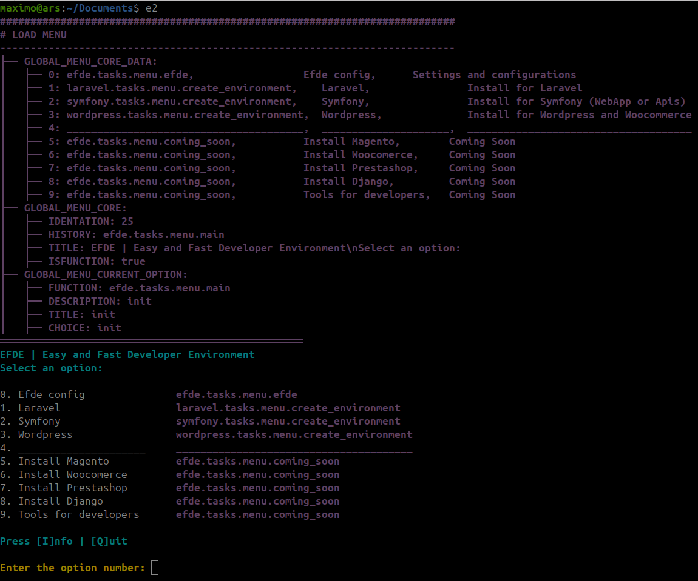

# EFDE | Easy and fast development environment
In this small guide you will find all the necessary elements if you want to start collaborating on the project.

Here are mentioned the variables and workflow that must be considered when
- Fix a bug
- Improve an existing feature
- Add a new feature

# Report issue 
In case you want to contribute, you can do so by reporting a new issue from [here](https://github.com/mmaximo33/EFDE/issues/new/choose)

to begin following up on the request.

# Prepare development environment
To prepare the EFDE development environment, see the following steps according to the corresponding role.

## Collaborators
```sh
# Prepare environment
mkdir -p ~/Domains
cd $_
git clone https://github.com/mmaximo33/EFDE.git efdev
cd $_
ln -sfT $PWD/bin/efde.sh ~/bin/efdev 
# Check the installation by running 'efdev' in your console

# Begin to work
git switch develop
git pull origin master
git checkout -b <issue-new-feature> # example 31-description-of-new-feature
git add <files>
git commit "feat/fix (environment): feature description" # See https://www.conventionalcommits.org/en/v1.0.0/

# Confirm that it is up to date with other updates
git rebase origin/develop
# Verify that there are no conflicts
git status
# If there are, resolve them, add the changes and commit.
# git add <files>
# git commit "fix (environment):  resolved conflicts"
# git rebase --continue

# Upload your changes
git push origin <issue-new-feature> --force-with-lease
```

### Full developer
To have all the developer features activated modify `bin/efde.sh`

```sh
declare -gA GLOBAL_EFDE_CONFIG=(
...
[EFDE_MODE_DEBUG]=true          # Debug Messages
[EFDE_MODE_DEVELOP]=true        # MMTodo: Prepared for create tmps
..
)
```

## Admin
### To Develop
```sh
git switch develop
git fetch origin <issue-new-feature>
git merge <issue-new-feature>

# Remember to update the docs CHANGELOG.md, README.md 
git add CHANGELOG.md 
git commit -m "fix (doc): update changelog" 

git push origin develop --force-with-lease
```

### To Main (Release)
```sh
# See https://semver.org/
git fetch --tags

git tag -a <major.minor.patch> -m "<major.minor.patch> comments" 
# git tag -a 1.0.0 -m "1.0.0 comments" 

git push origin <major.minor.patch>

# Create new pull request in github
```

# Configurations
**EFDE** has its own configurations which it uses in each new execution

These configurations are established on the first run and are stored in the file `bin/config.env`

## All Settings
```sh
HOST_SO="Linux | windows | macOS"
HOST_EDITOR="nano | vim | nvim"

EFDE_LAST_UPDATE="2024-01-20"
EFDE_LANGUAGE="en_US | es_ES | pt_PT"
EFDE_VERSION="2.0.0"

CLI_DEFAULT="false"                    
CLI_SHOW_CLI="true"
CLI_SHOW_OUTPUT="true"

# Only Developer 
EFDE_MODE_DEBUG=false                  # Messages debug
EFDE_MODE_DEVELOPER=false              # Transformation multifiles
```

## Command line Settings

|              | CLI_DEFAULT                     | CLI_SHOW_CLI            | CLI_SHOW_OUTPUT           |
|--------------|---------------------------------|-------------------------|---------------------------|
| **Mode**     | Established by implementation   | Command executed        | Command output            |
| **Default**  | True                            | n/a                     | n/a                       |
| **Training** | False                           | True                    | False                     |
| **Auditor**  | False                           | True                    | True                      |
| **Silent**   | False                           | False                   | False                     |

## EFDE Modes Settings (for EFDE collaborators)

| EFDE_MODE_DEBUG                                    | EFDE_MODE_DEVELOP                                                                | 
|----------------------------------------------------|----------------------------------------------------------------------------------|
| Shows additional information for debugging actions | On each run, clean the `bin/.tmp` directory and transform the files individually | 
|     |                               |  


# Rules 
If you want to add a new feature you must keep the following rules in mind
- Define type
  - Service: (docker, mysql, phpmyadmin, mailhog, others)
  - Implementation: frameworks, cms, others (symfony, laravel, magento, woordpress, prestashop, others)
- Inside `console/{Implemention | Service}` creates the directory with your name (example: `wordpress`)
  - In `console/implemention/wordpress`
  - Add the init file to the root of the directory `./init`, 
  - Create the directories
    - `./tasks`
      - Create your bash files, the methods here must start with `_mod_.FUNCTION_NAME`
      - You can call other methods as appropriate to your location `common.tasks.menu.FUNCTION_NAME`
    - `./props`
      - Create your bash files, the properties here must start with `_mod_PROPERTY_NAME`
        - **Important**: It does not have the point in the middle like the methods `_mod_.` vs `_mod_` 

# Workflow
- When executing in glogal symbolic link `~/bin/efde -> ~/.efde/bin/efde`
- Is loaded `console/init`
  - By default change the CORE `console/common/core` in `bin/.tmp/core` (to work on the transformation)
  - It loops through all the directories within `./console` recursively until it finds a folder called `../task`
  - At that moment the transformation of the files found in that implementation or service begins `./console/.../wordpress/{tasks | accessories}`
    - `EFDE_MODE_DEVELOP=true`, rename files, methods and variables in a `bin/.temp/{files}` directory
      - Files: multiple files from 
        - `console/efde/tasks/menu` to `bin/.tmp/efde.tasks.menu`
        - `console/efde/props/menu` to `bin/.tmp/efde.props.menu`
      - Methods: from `_mod_.main` to `efde.tasks.menu.main`
      - Variables: from `_mod_MAIN` to `efde_prop_menu_MAIN`
    - `EFDE_MODE_DEVELOP=false`, change the name of methods and variables in `bin/.temp/transformation` (File with all the code)
      - File: single file
-  Determines whether the launch directory in the `efde` command console has a project created by it or not (search for `$PATH/.efde/`)
   - Is TRUE, loads the implementation menu according to what is established in the `$PATH/.efde/.env` file variable `EFDE_PROJECT_IMPLEMENTION`
   - Is FALSE, load the default menu to configure `efde` or install implementations

# Translations
- Translations must be incorporated into each implementation with the **i18n** directory
- The languages available so far are
    - en_US (Default)
    - es_ES
    - pt_PT
- They must follow the following pattern ```
"text_en_us","text_translations"```
- Considerations
  - You cannot use characters like ```\ \"```