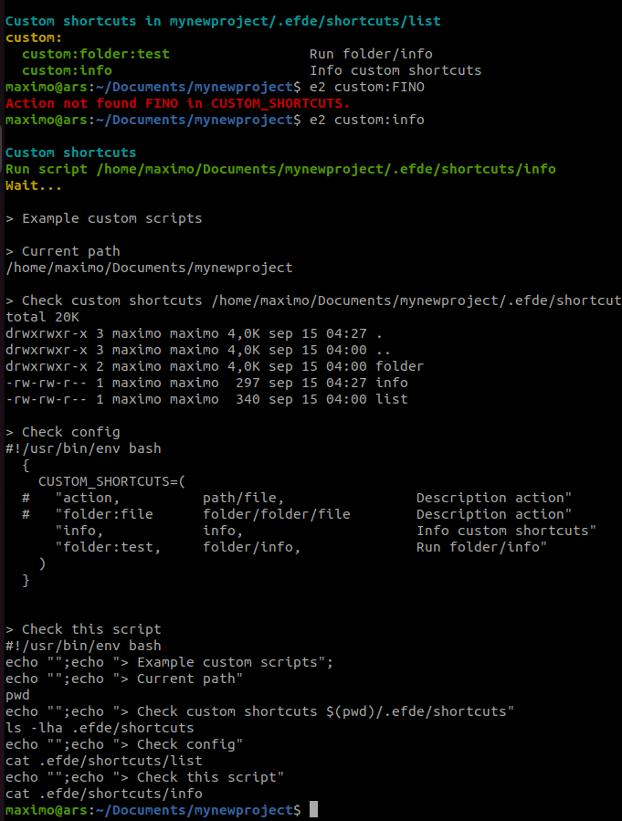

# EFDE | Easy and fast development environment

## Index
- [EFDE CONFIG](#efde-config)
  - [Global](#global-config)
  - [For project](#project-config)
- [Basic Use](#basic-use)

## Efde config
Distributing configurations for local deployments between different team members is easy with **EFDE**

### Global config
The global **EFDE** configurations can be found in
```sh
cat ~/.efde/bin/config.env 
```

### Project config
Configurations for implementations installed with **EFDE** are located in

```sh
cd  <project>     # Project folder

cat .efde/.env    # Variable file  
ls -la .env       # Symbolic link for docker recipe
```

## Basic Use 
Below we show you some of the characteristics that all implementations have. 
This may vary depending on the framework, language or technology, adjusting to the needs of each type of project.


## Custom Shortcuts
You can add custom shortcuts per project.

Since version 2.2.1 you can find example data in the following directory

`project/.efde/shortcuts/`
- List: In this list you can add your custom commands
  - First term, it is the alias for the shortcuts, where the prefix `custom:` is added
  - Second term, the location of the bash file to execute
  - Third term, the description for your custom shortcut
- Files Bash: Inside the shortcuts directory, you can add bash files with your custom scripts or create subfolders if necessary

**Clarification: These shortcuts are NOT global to EFDE, they are executed at the project level**

